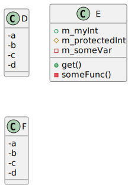

# Puml parser

This is a small project with the intention to parse C++ files into Plant UML diagrams.

The project is build in rust and utilizes the LLVM/Clang toolchain to parse the C++ files and genertes the respective Plant UML components from the parsed AST entities.

The generated output can look something like (from [`tests/test.cpp`](tests/test.cpp)):
<!-- Side by side code / images -->

    

## Dependencies

The main dependency is obviously the Clang lib. In rust this project utilizes the [`clang-rs`](https://github.com/KyleMayes/clang-rs) crate which provides a wrapper for `libclang`.

## CI

The CI performs a base set of tests according to the `action-rs` [quickstart](https://github.com/actions-rs/meta/blob/master/recipes/quickstart.md) template.
It runs:

* `cargo check` - checks for errors without complete compilation
* `cargo test` - executes the unittests
* [`cargo fmt`](https://github.com/rust-lang/rustfmt) - verifies the formatting was applied correctly
* [`cargo clippy`](https://github.com/rust-lang/rust-clippy) - provides code improvements
